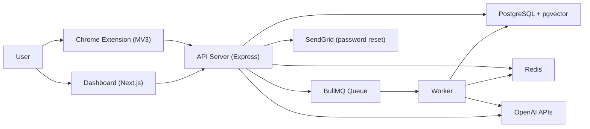
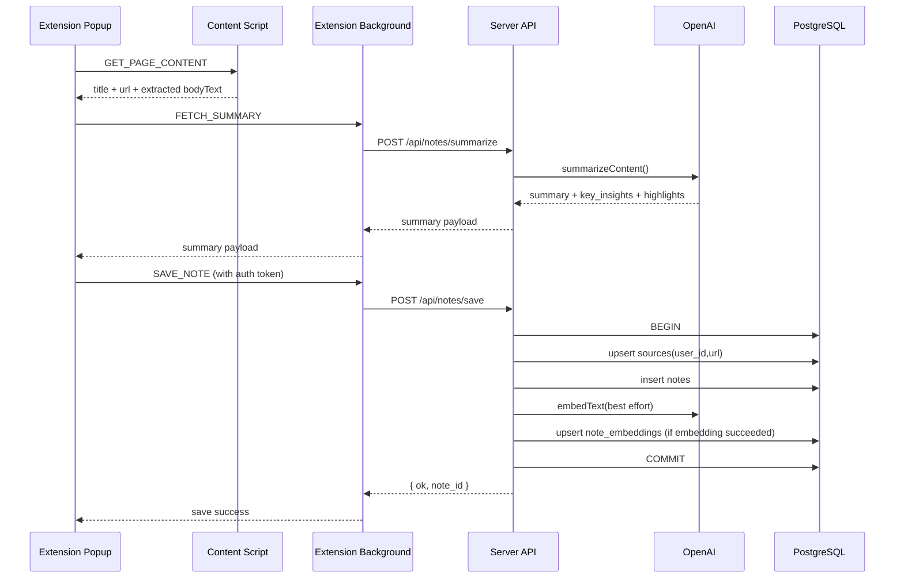

# Semantic Web Intelligence Platform Project Architecture

## 1) System Overview

Semantic Web Intelligence Platform is a multi-app repository with three user-facing surfaces and two backend processes:

- `extension/` (Chrome extension): captures page content, requests summarization, and saves notes.
- `dashboard/` (Next.js app): authentication, notes, collections, analytics, search, and AI views.
- `server/` (Express API): auth, notes CRUD, semantic retrieval, analytics, queue orchestration.
- `server/src/worker.ts` (BullMQ worker): executes heavier AI jobs asynchronously.
- Data layer:
  - PostgreSQL + `pgvector` for relational data + embeddings.
  - Redis for queue transport, caching, and budget counters.



## 2) Repository Architecture

```text
swip/
  ARCHITECTURE.md
  docker-compose.yml           # Postgres(pgvector) + Redis
  schema.sql                   # DB schema and indexes
  dashboard/                   # Next.js 16 + React 19 UI
    src/app/                   # Route-based pages
    src/lib/                   # api client + job polling helper
    src/components/            # Shared UI shell + toast
  server/                      # Express API + worker
    src/index.ts               # HTTP server + route mounting
    src/routes/                # API route handlers
    src/services/              # OpenAI/auth/mailer adapters
    src/jobs/aiJobs.ts         # Heavy AI generators
    src/worker.ts              # BullMQ worker process
    src/queue.ts               # Redis + queue + cache + budget helpers
    src/dbpg.ts                # PostgreSQL pool
  extension/                   # Browser extension (MV3)
    manifest.json
    contentScript.js
    background.js
    popup.js
```

## 3) Backend Module Boundaries

- API boundary: `server/src/index.ts` mounts route modules under `/api/*`.
- Auth boundary:
  - JWT middleware: `server/src/middleware/auth.ts`
  - Password/JWT helpers: `server/src/services/auth.ts`
  - Auth routes: `server/src/routes/auth.ts`
- Knowledge ingestion:
  - Summarization: `POST /api/notes/summarize`
  - Save note + embedding upsert: `POST /api/notes/save`
- Retrieval + reasoning:
  - Vector retrieval + answer synthesis: `/api/ask`, `/api/recall`
  - Query history: `/api/qa`
- Async heavy AI:
  - Queue producers: `/api/digest`, `/api/graph`, `/api/recommendations`, `/api/contradictions`
  - Queue consumer: `server/src/worker.ts`
  - Job builders: `server/src/jobs/aiJobs.ts`
  - Job status API: `/api/jobs/:id`
- Cross-cutting controls:
  - Redis caching: `cacheGet`, `cacheSet`
  - Per-user daily budgets: `consumeDailyBudget`
  - Rate limiting on auth/retrieval/heavy AI routes.

## 4) Frontend Module Boundaries

- Shared API client: `dashboard/src/lib/api.ts`
  - Injects `Authorization: Bearer <token>` from local storage.
- Async job polling helper: `dashboard/src/lib/jobs.ts`
- Route groups in `dashboard/src/app`:
  - Auth flow: `login`, `register`, `forgot-password`, `reset-password`
  - Core knowledge: `dashboard`, `notes`, `collections`, `analytics`
  - AI features: `ask`, `recall`, `digest`, `graph`, `recommendations`, `contradictions`

## 5) Data Architecture

Core tables from `schema.sql`:

- Identity: `users`, `password_reset_tokens`
- Knowledge: `sources`, `notes`, `note_embeddings`, `note_likes`
- Organization: `collections`, `collection_notes`
- AI interactions: `qa_history`, `ai_jobs`

Storage strategy:

- Postgres = source of truth.
- `pgvector` (`note_embeddings.embedding`) enables semantic similarity (`<=>`) search.
- Redis = ephemeral cache + request budgets + queue broker.

## 6) Key Runtime Flows

### A) Capture and Save a Note (Extension -> API -> DB)



Detailed behavior:

1. Extension extracts readable page text using heuristics (`article/main` first, then largest low-link container), with a hard client-side size cap.
2. `POST /api/notes/summarize` validates `content`, calls LLM summarization, and returns JSON fields expected by the popup.
3. User chooses Save, and extension sends `POST /api/notes/save` with `Authorization: Bearer <token>`.
4. API verifies JWT, starts a DB transaction, upserts `sources`, inserts `notes`.
5. API attempts embeddings for the saved note and upserts `note_embeddings`.
6. Embeddings are non-blocking: embedding errors are logged and note save still succeeds.
7. Transaction commits and the extension receives the new `note_id`.

### B) Ask and Recall (Online Semantic Retrieval + LLM Synthesis)

Shared request shape:

1. Dashboard sends authenticated request:
   - `POST /api/ask` with `{ question }`
   - `POST /api/recall` with `{ query }`
2. API runs auth + rate limiter.
3. API consumes per-user daily budget in Redis (`INCR` + 24h TTL key).
4. API checks Redis response cache first (`ask:<user>:<question>` or `recall:<user>:<query>`).
5. On cache miss, API embeds the input text using OpenAI embeddings.
6. API performs pgvector nearest-neighbor query over `note_embeddings` joined with user notes.
7. API builds note context and prompts LLM for strict JSON output.
8. API normalizes/parses JSON output, caches result for 6h, and returns response.

Differences:

- `ask` returns `answer`, `citations`, and `answer_with_citations`.
- `recall` returns `answer` and `sources`.
- Dashboard stores ask history with `POST /api/qa` for later retrieval in `/api/qa`.

### C) Heavy AI Features (Queued Async Jobs)

Applies to:

- `GET /api/digest/weekly`
- `GET /api/graph`
- `GET /api/recommendations`
- `GET /api/contradictions`

Execution flow:

1. Dashboard calls endpoint with JWT.
2. API checks auth, route limiter, and heavy daily budget.
3. API checks Redis cache by feature/user key.
4. If cache hit: return result immediately.
5. If miss: enqueue BullMQ job on `ai-jobs` queue with retries/backoff.
6. API inserts tracking row into `ai_jobs` and returns `{ status: "queued", job_id }`.
7. Dashboard polls `GET /api/jobs/:id` roughly once per second.
8. Worker consumes queue job, loads relevant notes, runs feature-specific prompt generation, stores result.
9. Worker writes result to Redis cache and updates `ai_jobs` row to `completed` (or `failed` on error).
10. Polling endpoint returns `completed` + `result` once ready.

### D) Runtime Branches and Failure Semantics

- Auth failure: any protected route returns `401` (`Missing auth token` or `Invalid/expired token`).
- Budget exceeded: route returns `429` (ask/recall/heavy each have separate daily budgets).
- No semantic matches: ask/recall return graceful empty-result answers instead of errors.
- Queue durability: job status is read from BullMQ when present, otherwise from `ai_jobs` table fallback.
- LLM JSON guardrails: JSON extraction/cleanup is applied before parse; invalid output raises controlled server errors.
- Missing `OPENAI_API_KEY`:
  - summarization route can return fallback stub content.
  - ask/recall/heavy jobs fail because strict JSON AI caller requires the key.

## 7) Environment and Ports

- Dashboard (`dashboard`): `NEXT_PUBLIC_API_BASE_URL` (default `http://localhost:4000`).
- Server (`server`):
  - `PORT` (default `4000`)
  - `DATABASE_URL`
  - `REDIS_URL` (default `redis://localhost:6379`)
  - `JWT_SECRET`
  - `OPENAI_API_KEY`, `EMBEDDING_MODEL`
  - `SENDGRID_API_KEY`, `SENDGRID_FROM_EMAIL`, `FRONTEND_URL`
  - Budget configs: `DAILY_ASK_LIMIT`, `DAILY_RECALL_LIMIT`, `DAILY_HEAVY_LIMIT`
- Infra (`docker-compose.yml`):
  - Postgres/pgvector: host port `5433`
  - Redis: host port `6379`

## 8) Recommended Target Architecture (Next Iteration)

Keep current behavior, but gradually harden boundaries:

- Move to explicit app layout:
  - `apps/dashboard`
  - `apps/server`
  - `apps/extension`
  - `packages/shared-types` (request/response types, domain types)
- Split backend by domain modules:
  - `modules/auth`
  - `modules/notes`
  - `modules/collections`
  - `modules/ai` (ask/recall/heavy jobs)
- Add service interfaces:
  - `providers/openai.ts`
  - `providers/mailer.ts`
  - `providers/cache.ts`
- Add test architecture:
  - unit tests for services and prompt parsers
  - integration tests for route contracts and auth guards
  - worker tests for queue job transitions.

This gives cleaner ownership, stronger type-sharing, and easier scaling without changing product behavior.
