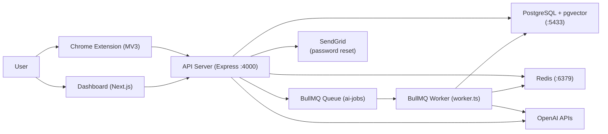

# Semantic Web Intelligence Platform — Comprehensive Project Documentation Report

> **Generated:** 2026-03-02 | **Codebase Path:** `/Users/kashishdesai/Projects/Sementic Web Intelligence Platform`

---

## 1. Project Overview

### What It Does
Semantic Web Intelligence Platform is a **personal AI-powered knowledge base** that lets users browse the web naturally and capture, summarize, and semantically query everything they've read. The system has three surfaces:

1. **Chrome Extension** — On any web page, click the extension, press "Summarize", and the AI produces a structured summary, key insights, and highlight quotes. A single "Save" stores the note into your personal knowledge base.
2. **Dashboard (Next.js web app)** — A full-featured web app where users manage notes and collections, run semantic search, ask natural-language questions about their knowledge base, and trigger advanced AI features (weekly digest, concept graph, recommendations, contradiction detection).
3. **Express API Server** — The backend that powers both surfaces.

### Core Problem It Solves
The information overload problem: people read hundreds of articles, papers, and docs but retain almost none of it. Semantic Web Intelligence Platform acts as a "second brain" — it captures, summarizes, and makes knowledge **semantically queryable** so users can ask "what did I read about X?" and get a grounded, cited answer from their own notes.

### Target Users / Use Case
- Knowledge workers, researchers, students, and developers who consume large amounts of web content daily.
- People who want to build a personal, searchable knowledge base without manual note-taking.
- Use cases: research synthesis, studying, tracking ideas across articles, finding contradictions in sources.

---

## 2. Tech Stack

### Frontend
| Layer | Technology |
|---|---|
| Framework | **Next.js 16.1.6** (App Router) |
| UI Library | **React 19.2.3** |
| Data visualization | **d3-force 3.0.0** (knowledge graph rendering) |
| Styling | Vanilla CSS (no Tailwind, no UI component library) |
| Language | TypeScript 5 |
| HTTP client | Native `fetch` via custom `dashboard/src/lib/api.ts` wrapper |

### Backend
| Layer | Technology |
|---|---|
| Runtime | **Node.js** |
| Framework | **Express 5.2.1** |
| Language | **TypeScript 5.9.3** |
| HTTP logging | `morgan` (combined format) |
| CORS | `cors` 2.8.5 (currently open: `origin: "*"`) |
| Config | `dotenv` |
| Dev runner | `ts-node-dev` (hot-reload) |

### AI / ML Layer
| Component | Technology |
|---|---|
| LLM (summarization + QA) | **OpenAI gpt-4o-mini** via `openai` SDK v6.15.0 |
| Embeddings | **OpenAI text-embedding-3-small** (1536 dimensions, configurable via `EMBEDDING_MODEL`) |
| Async AI job queue | **BullMQ 5.19.0** on Redis |
| AI job types | `digest`, `graph`, `recommendations`, `contradictions` |

### Database
| Component | Technology |
|---|---|
| Relational + vector DB | **PostgreSQL 16** + **pgvector** extension |
| ORM / query | Raw SQL via **`pg` 8.17.1** (node-postgres pool) |
| Schema management | Manual `schema.sql` (no migration framework) |
| Legacy (commented out) | `better-sqlite3` — original SQLite prototype, fully superseded |
| Cache + budget counters | **Redis 7-alpine** via **`ioredis` 5.4.1** |

### DevOps
| Component | Technology |
|---|---|
| Local infra | **Docker Compose** (`pgvector/pgvector:pg16` + `redis:7-alpine`) |
| CI/CD | **None present** in the codebase |
| Containerization | Only DB/Redis are containerized; app servers run directly on host |
| Deployment | **Not deployed** — runs locally |

### Third-Party Integrations
| Service | Purpose |
|---|---|
| **OpenAI API** | Summarization (gpt-4o-mini) + Embeddings (text-embedding-3-small) |
| **SendGrid** (`@sendgrid/mail` 8.1.4) | Password reset emails |

---

## 3. System Architecture

### High-Level Architecture



### Architecture Style
**Monolith** — The Express API server contains all routes, services, and business logic. There are no microservices. The worker is a separate process (`worker.ts`) but shares the same codebase and data layer.

### How the AI Component Connects
- **Synchronous AI (ask, recall, summarize):** The API route directly calls OpenAI APIs via `services/ai.ts` (`callJson`) and `services/llm.ts` (`summarizeContent`). Response is returned inline.
- **Asynchronous AI (digest, graph, recommendations, contradictions):** The API enqueues a BullMQ job on the `ai-jobs` queue. The worker process picks it up, calls OpenAI, writes results to Redis (cache) and Postgres (`ai_jobs` table), and the dashboard polls `GET /api/jobs/:id`.

### Data Flow: User Input → Output (Ask Flow)
1. User types a question in the Dashboard `/ask` page.
2. Dashboard calls `POST /api/ask { question }` with `Authorization: Bearer <token>`.
3. API verifies JWT → checks Redis daily budget (`budget:ask:<userId>`) → checks Redis response cache.
4. Cache miss → embed the question via OpenAI `text-embedding-3-small` → pgvector nearest-neighbor query against `note_embeddings` → retrieve top 5 semantically similar notes.
5. Build prompt with note context → call `gpt-4o-mini` → JSON-parse response → cache in Redis (6h TTL) → return `{ answer, citations, answer_with_citations }`.

### Authentication & Authorization
- **JWT-based auth**: `POST /api/auth/login` issues a signed JWT (`jsonwebtoken`). The token is stored in the browser's `localStorage` (dashboard) or `chrome.storage.local` (extension).
- **Middleware**: `requireAuth` (`server/src/middleware/auth.ts`) verifies the Bearer token on every protected route and attaches `req.user = { id, email, name }`.
- **Data isolation**: Every DB query filters by `user_id` — users can only access their own notes, collections, sources, and history.

### Caching Layers
| Cache Key | TTL | Purpose |
|---|---|---|
| `ask:<userId>:<question>` | 6 hours | Ask Q&A responses |
| `recall:<userId>:<query>` | 6 hours | Recall responses |
| `digest:<userId>` | 6 hours | Weekly digest result |
| `graph:<userId>` | 12 hours | Knowledge graph result |
| `recommendations:<userId>` | 6 hours | Recommendation result |
| `contradictions:<userId>` | 6 hours | Contradiction analysis |
| `budget:ask:<userId>` | 24 hours | Per-user ask budget counter |
| `budget:recall:<userId>` | 24 hours | Per-user recall budget counter |
| `budget:heavy:<userId>` | 24 hours | Per-user heavy AI budget counter |

---

## 4. Workflow & Business Logic

### Core User Journey: Capture & Save a Note (Extension)

1. User is on any `https://` page and clicks the Semantic Web Intelligence Platform browser extension icon.
2. Extension popup opens → `popup.js` calls `chrome.tabs.query` to get the active tab ID.
3. `injectContentScript(tabId)` is called to ensure `contentScript.js` is running.
4. Popup sends `GET_PAGE_CONTENT` message to content script.
5. **Content script** (`contentScript.js`) runs `extractMainText()`:
   - First tries semantic selectors: `article`, `main`, `[role='main']`, `.article`, `.post`, `.content`, `#content`.
   - Falls back to `getLargestTextContainer()` — scans all `div`/`section` elements, picks the longest text block with a low link-density ratio (<0.01 links per char) to exclude navigation.
   - Hard caps at **15,000 characters** client-side.
6. Popup sends `FETCH_SUMMARY` to background service worker → `background.js` calls `POST /api/notes/summarize` (no auth required).
7. Server calls `summarizeContent()` in `services/llm.ts`:
   - Truncates content to **6,000 characters** server-side.
   - Sends to `gpt-4o-mini` with strict JSON prompt specifying the `{ summary, key_insights, highlights }` schema.
   - Falls back to stub summary if `OPENAI_API_KEY` is missing.
8. Popup displays results. User clicks "Save" → popup sends `SAVE_NOTE` message.
9. If not logged in, login form appears. Auth via `POST /api/auth/login`.
10. Background sends `POST /api/notes/save` with Bearer token.
11. Server: JWT verified → DB transaction begins → `sources` upserted (deduplicates by `user_id + url`) → `notes` inserted → **best-effort embedding** via `embedText()` (failure does not abort the save) → `COMMIT`.
12. Extension displays `"Saved. Note ID: <id>"`.

### Core User Journey: Ask AI (Dashboard)
1. User navigates to `/ask` page. Types a question and submits.
2. `POST /api/ask { question }` → auth → daily budget check (50/day default) → cache check.
3. Question embedded via `text-embedding-3-small` → pgvector cosine similarity query (`<=>` operator) over `note_embeddings`, top 5 notes returned.
4. LLM prompt constructed: notes context injected, strict JSON schema enforced.
5. Response returned with `answer`, `citations` (note_id, title, url, highlights), and `answer_with_citations` (inline `[1]`, `[2]` references).
6. History stored via `POST /api/qa`.

### Core User Journey: Heavy AI Features (Async Queue)
Applies to: `/digest`, `/graph`, `/recommendations`, `/contradictions`.
1. Dashboard calls the endpoint with JWT.
2. API checks budget (separate `heavy` bucket), checks cache.
3. On cache miss: enqueues BullMQ job on `ai-jobs` queue → inserts row in `ai_jobs` table with `status: queued` → returns `{ status: "queued", job_id }`.
4. Dashboard polls `GET /api/jobs/:id` ~1/second via `dashboard/src/lib/jobs.ts`.
5. Worker (`worker.ts`) picks up job → runs feature-specific builder (`buildWeeklyDigest`, `buildGraph`, `buildRecommendations`, `buildContradictions` from `jobs/aiJobs.ts`) → writes result to Redis cache and updates `ai_jobs.status = "completed"`.
6. Next poll returns `completed` + full result.

### Key Algorithms
- **Semantic Search**: pgvector IVFFlat index with cosine distance (`<=>` operator). Default `lists = 100`. Top-K retrieval (K=5 for ask/recall, up to 50/200 for search endpoint).
- **Budget Counter**: Redis `INCR` + `EXPIRE 86400s` pattern. Simple, atomic, and fast.
- **JSON extraction from LLM**: `extractJson()` in `services/ai.ts` strips markdown fences, finds first `{` or `[`, slices to matching close bracket. `fixInvalidBackslashes()` sanitizes escape sequences before parsing.
- **Content Extraction Heuristic**: Semantic selectors first, then largest low-link-density text block, then `document.body` as last resort.

### Error Handling & Fallback Strategies
| Scenario | Behavior |
|---|---|
| `OPENAI_API_KEY` missing on summarize | Returns stub summary (no error to user) |
| `OPENAI_API_KEY` missing on ask/recall | Hard error — `500` returned |
| Embedding fails on note save | Warning logged; note save still succeeds |
| No semantic matches found | Returns `{ answer: "No notes found yet.", citations: [] }` gracefully |
| LLM returns invalid JSON | `extractJson` + `fixInvalidBackslashes` applied; if still invalid, throws controlled `500` |
| Budget exceeded | Returns `429 "Daily X limit reached"` |
| JWT missing/invalid | Returns `401` |
| BullMQ job fails | `worker.on("failed")` updates `ai_jobs.status = "failed"` with error message |
| DB transaction error | `ROLLBACK` called; `500` returned |
| Similarity threshold too strict (search) | Automatic fallback retry without the threshold |

### Features Explained
| Feature | Route | Description |
|---|---|---|
| **Summarize** | `POST /api/notes/summarize` | AI summarizes any web page; unauthenticated endpoint used by extension |
| **Save Note** | `POST /api/notes/save` | Saves summary + embedding to Postgres; authenticated |
| **Browse Notes** | `GET /api/notes` | Lists all user notes with like status; paginates up to 200 |
| **Semantic Search** | `GET /api/notes/search` | Vector-similarity search over notes with optional collection filter |
| **Like/Unlike** | `POST/DELETE /api/notes/:id/like` | Toggles like on a note |
| **Collections** | `/api/collections` | CRUD for grouping notes into named collections |
| **Ask** | `POST /api/ask` | QA over user's notes with citations |
| **Recall** | `POST /api/recall` | Memory retrieval with source attribution |
| **Analytics** | `GET /api/analytics/summary` | Notes per day, top domains, totals; range: week/month/6months/year |
| **Weekly Digest** | `GET /api/digest/weekly` | Async: AI-generated summary of recent notes |
| **Knowledge Graph** | `GET /api/graph` | Async: concept graph from notes (rendered with d3-force) |
| **Recommendations** | `GET /api/recommendations` | Async: AI suggests what to read next |
| **Contradiction Finder** | `GET /api/contradictions` | Async: detects conflicting claims across notes |
| **Q&A History** | `GET/POST /api/qa` | Stores and retrieves ask history |
| **Sources** | `GET /api/sources` | Lists all unique web sources captured |
| **Password Reset** | `POST /api/auth/forgot` + `/reset` | Secure token-based reset via SendGrid email |

---

## 5. Folder Structure & Code Organization

```
swip/
├── ARCHITECTURE.md              # Architecture documentation
├── docker-compose.yml           # Postgres (pgvector) + Redis containers
├── schema.sql                   # Full DB schema (no migration tool)
│
├── extension/                   # Chrome Extension (Manifest V3)
│   ├── manifest.json            # Extension config, permissions
│   ├── contentScript.js         # Injected into pages; extracts text
│   ├── background.js            # Service worker; calls API
│   ├── popup.html               # Extension popup UI
│   ├── popup.js                 # Popup logic (auth, summarize, save)
│   └── popup.css                # Popup styles
│
├── dashboard/                   # Next.js 16 + React 19 web app
│   ├── src/
│   │   ├── app/                 # Next.js App Router pages
│   │   │   ├── login/           # Auth pages
│   │   │   ├── register/
│   │   │   ├── forgot-password/
│   │   │   ├── reset-password/
│   │   │   ├── dashboard/       # Home dashboard
│   │   │   ├── notes/           # Notes browser
│   │   │   ├── collections/     # Collections management
│   │   │   ├── analytics/       # Usage analytics
│   │   │   ├── ask/             # Ask AI (QA)
│   │   │   ├── recall/          # Memory recall
│   │   │   ├── digest/          # Weekly digest
│   │   │   ├── graph/           # Knowledge graph (d3-force)
│   │   │   ├── recommendations/ # Reading recommendations
│   │   │   └── contradictions/  # Contradiction detector
│   │   ├── components/          # Shared UI components
│   │   └── lib/
│   │       ├── api.ts           # Typed API client (injects Bearer token)
│   │       └── jobs.ts          # Async job polling helper
│
└── server/                      # Express API + BullMQ worker
    ├── src/
    │   ├── index.ts             # App entry; mounts all routers
    │   ├── worker.ts            # BullMQ worker process (separate)
    │   ├── queue.ts             # Redis client, Queue, cacheGet/Set, budget
    │   ├── dbpg.ts              # PostgreSQL pool (pg)
    │   ├── db.ts                # Legacy better-sqlite3 (unused)
    │   ├── env.ts               # dotenv loader
    │   ├── types.ts             # AuthUser type
    │   ├── middleware/
    │   │   └── auth.ts          # requireAuth JWT middleware
    │   ├── services/
    │   │   ├── llm.ts           # summarizeContent() via gpt-4o-mini
    │   │   ├── ai.ts            # callJson<T>() generic LLM caller
    │   │   ├── embeddings.ts    # embedText() via text-embedding-3-small
    │   │   ├── auth.ts          # hashPassword, verifyPassword, signToken
    │   │   └── mailer.ts        # sendResetEmail() via SendGrid
    │   ├── jobs/
    │   │   └── aiJobs.ts        # buildWeeklyDigest, buildGraph,
    │   │                        # buildRecommendations, buildContradictions
    │   └── routes/
    │       ├── auth.ts          # /api/auth  (register, login, me, forgot, reset)
    │       ├── notes.ts         # /api/notes (CRUD, summarize, search, like)
    │       ├── collections.ts   # /api/collections
    │       ├── sources.ts       # /api/sources
    │       ├── analytics.ts     # /api/analytics
    │       ├── ask.ts           # /api/ask
    │       ├── recall.ts        # /api/recall
    │       ├── qa.ts            # /api/qa
    │       ├── digest.ts        # /api/digest
    │       ├── graph.ts         # /api/graph
    │       ├── recommendations.ts # /api/recommendations
    │       ├── contradictions.ts  # /api/contradictions
    │       └── jobs.ts          # /api/jobs/:id (polling)
```

### Naming Conventions
- Route files named after their resource (e.g., `notes.ts`, `ask.ts`).
- Service files named after their external dependency (e.g., `llm.ts`, `embeddings.ts`, `mailer.ts`).
- Internal helpers (`cacheGet`, `cacheSet`, `consumeDailyBudget`) co-located in `queue.ts`.

### Design Patterns
- **Router per resource**: Each `routes/*.ts` file is a self-contained Express Router.
- **Service layer**: `services/` wraps external APIs (OpenAI, SendGrid, bcrypt, JWT) with simple typed functions — basic facade pattern.
- **Middleware chain**: `requireAuth` + `rateLimit` applied per-route.
- **Best-effort side effects**: Embedding upsert on note save is deliberately wrapped in `try/catch` so failures are non-fatal.
- **Strategy pattern (implicit)**: Worker's switch-case dispatches to feature-specific job builders.

> [!NOTE]
> `db.ts` (better-sqlite3) is still present in `src/` but entirely unused. All code was migrated to PostgreSQL (`dbpg.ts`). The dead file can be removed.

---

## 6. API Design

The API is **REST-style**, versioned only by path prefix `/api/*`. No versioning scheme (e.g., `/v1/`) is implemented. All endpoints accept/return JSON.

### Authentication Routes (`/api/auth`)
| Method | Path | Auth | Body | Response |
|---|---|---|---|---|
| POST | `/api/auth/register` | No | `{ email, password, name }` | `{ token, user }` |
| POST | `/api/auth/login` | No | `{ email, password }` | `{ token, user }` |
| GET | `/api/auth/me` | JWT | — | `{ user }` |
| POST | `/api/auth/forgot` | No | `{ email }` | `{ ok: true }` |
| POST | `/api/auth/reset` | No | `{ token, new_password }` | `{ ok: true }` |

### Notes Routes (`/api/notes`)
| Method | Path | Auth | Description |
|---|---|---|---|
| POST | `/api/notes/summarize` | No | AI-summarize page content |
| POST | `/api/notes/save` | JWT | Save a note (upserts embedding) |
| GET | `/api/notes` | JWT | List notes (`?limit=50`) |
| GET | `/api/notes/search` | JWT | Semantic search (`?q=&limit=&min_similarity=&collection_id=`) |
| GET | `/api/notes/:id` | JWT | Get single note |
| DELETE | `/api/notes/:id` | JWT | Delete a note |
| POST | `/api/notes/:id/like` | JWT | Like a note |
| DELETE | `/api/notes/:id/like` | JWT | Unlike a note |

### AI Routes
| Method | Path | Auth | Type | Budget |
|---|---|---|---|---|
| POST | `/api/ask` | JWT | Sync | 50/day |
| POST | `/api/recall` | JWT | Sync | 50/day |
| GET | `/api/digest/weekly` | JWT | Async (queued) | Heavy budget |
| GET | `/api/graph` | JWT | Async (queued) | Heavy budget |
| GET | `/api/recommendations` | JWT | Async (queued) | Heavy budget |
| GET | `/api/contradictions` | JWT | Async (queued) | Heavy budget |
| GET | `/api/jobs/:id` | JWT | — | Polling endpoint |
| GET | `/api/qa` | JWT | — | QA history |

### Other Routes
| Path | Description |
|---|---|
| `/api/collections` | Full CRUD for collections |
| `/api/analytics/summary` | Usage stats (`?range=week\|month\|6months\|year`) |
| `/api/sources` | List captured web sources |
| `/health` | Server health check (`{ status: "ok" }`) |

### Rate Limiting
| Route group | Window | Max requests | Key |
|---|---|---|---|
| `/api/auth/*` | 1 min | 10 | email or IP |
| `/api/ask`, `/api/recall` | 1 min | 20 | user ID or IP |
| Heavy AI routes | Per env vars | Daily limit | Redis INCR |

### Pagination
- Notes list: `?limit=N` (max 200, default 50).
- Semantic search: `?limit=N` (max 50, default 10).
- No cursor/offset pagination — simple LIMIT queries.

### Request Body Size
Express JSON limit set to **2MB** (`express.json({ limit: "2mb" })`).

---

## 7. AI / ML Specifics

### Models Used
| Model | Usage | Why |
|---|---|---|
| `gpt-4o-mini` | Summarization, Ask, Recall, all heavy AI jobs | Cost-effective, fast, produces reliable JSON output |
| `text-embedding-3-small` | Generating 1536-dim embeddings for notes and queries | Low cost, strong semantic quality, pgvector compatible |

### Prompt Engineering Approach
All prompts are **zero-shot, strict JSON output** prompts. The pattern:
1. Role instruction: "You are an assistant that answers questions using ONLY the provided notes."
2. Schema declaration: Explicit TypeScript-style JSON type embedded in the prompt.
3. Rules list: "Output VALID JSON ONLY. No extra text, no markdown, no comments."
4. Context injection: Note content (title, URL, summary, key_insights, highlights) injected as plain text.
5. Query/question appended at the bottom.

### JSON Guardrails (services/ai.ts)
`callJson<T>()` implements a multi-step JSON extraction/repair pipeline:
1. `extractJson()` — strips markdown fences (` ```json `, ` ``` `), finds first `{`/`[` and last `}`/`]`.
2. `fixInvalidBackslashes()` — character-by-character scan to escape any backslashes not followed by a valid JSON escape character (`"`, `\`, `/`, `b`, `f`, `n`, `r`, `t`, `u`).
3. `JSON.parse()` — if this throws, a controlled `500` error is returned.

### RAG (Retrieval-Augmented Generation)
- **Embeddings stored**: When a note is saved, its combined text (`Summary + Key insights + Title + URL`) is embedded and stored in `note_embeddings.embedding` (vector(1536)).
- **Retrieval**: At query time, the user's question/query is embedded, then a pgvector cosine distance query (`<=>`) retrieves top-5 most semantically similar notes.
- **Synthesis**: The retrieved notes context is injected into the LLM prompt.
- **No fine-tuning**: The system is pure RAG — no model fine-tuning.
- **No vector-only search**: All semantic retrieval is scoped to `WHERE n.user_id = $1` for data isolation.

### Context Management
- No conversation memory across sessions.
- Q&A history is **stored** in `qa_history` and retrievable, but not fed back into subsequent prompts.
- Context window: top 5 notes per query. No chunking beyond the note-level unit.

### Token / Latency Optimization
- **Input truncation**: Content capped at 15,000 chars client-side (extension) and 6,000 chars server-side before the LLM call.
- **Response caching**: All LLM responses cached in Redis with 6–12 hour TTLs.
- **Budget controls**: Per-user daily limits prevent runaway API costs.
- **Async offloading**: Heavy AI features (digest, graph, recommendations, contradictions) are queued and executed asynchronously, preventing HTTP timeouts.
- **Best-effort embeddings**: Embedding failures on note save are swallowed, so the OpenAI embedding latency never blocks the save response.

---

## 8. Database & Data Layer

### Schema Overview

```
users (id, email, password_hash, name, created_at)
  │
  ├──< sources (id, user_id, url, title, domain, first_seen_at)
  │     └── UNIQUE (user_id, url)
  │
  ├──< notes (id, user_id, source_id, summary, key_insights JSONB, highlights JSONB, created_at)
  │     ├──< note_embeddings (note_id PK, embedding vector(1536), created_at)
  │     └──< note_likes (user_id, note_id, created_at) [composite PK]
  │
  ├──< collections (id, user_id, name, created_at)
  │     └── UNIQUE (user_id, name)
  │     └──< collection_notes (collection_id, note_id, created_at) [composite PK]
  │
  ├──< qa_history (id, user_id, question, answer, answer_with_citations, citations JSONB, created_at)
  │
  ├──< password_reset_tokens (id, user_id, token_hash, expires_at, used_at, created_at)
  │
  └──< ai_jobs (id TEXT, user_id, type, status, result JSONB, error, created_at, updated_at)
```

### Key Relationships
- `sources` are per-user and deduplicated by `(user_id, url)` — the same URL can exist for different users.
- `notes` reference `sources` — a note cannot exist without a source.
- `note_embeddings` is 1:1 with `notes` (ON CONFLICT DO UPDATE allows re-embedding).
- `collection_notes` is a many-to-many join table.
- `ai_jobs.id` is a TEXT field (BullMQ job IDs are strings/numbers, stored as strings).

### Indexing Strategy
| Index | Table | Columns | Type | Purpose |
|---|---|---|---|---|
| `idx_note_embeddings_vec` | `note_embeddings` | `embedding` | IVFFlat, cosine | Approximate nearest-neighbor search |
| `idx_notes_user_created_at` | `notes` | `(user_id, created_at DESC)` | B-tree | Notes list, analytics |
| `idx_sources_user_domain` | `sources` | `(user_id, domain)` | B-tree | Analytics top-domains query |
| `idx_qa_history_user_created_at` | `qa_history` | `(user_id, created_at DESC)` | B-tree | QA history retrieval |
| `idx_ai_jobs_user_created_at` | `ai_jobs` | `(user_id, created_at DESC)` | B-tree | Job history |
| `idx_collections_user` | `collections` | `(user_id)` | B-tree | Collections list |
| `idx_collections_user_name` | `collections` | `(user_id, name)` | Unique B-tree | Deduplication |
| `idx_note_likes_user` | `note_likes` | `(user_id)` | B-tree | Like queries |
| `idx_collection_notes_collection` | `collection_notes` | `(collection_id)` | B-tree | Collection notes listing |

> [!NOTE]
> IVFFlat index uses `lists = 100`. PostgreSQL recommends `sqrt(rows)` for `lists`. Performance degrades at very low row counts but scales well past ~10K rows.

### Data Validation Approach
Validation is done **at the route level** in Express handlers:
- Field presence checks (`if (!url || !summary)`)
- Email regex validation via `isValidEmail()` in `auth.ts`
- Password strength regex in `isStrongPassword()` (min 8 chars, 1 uppercase, 1 digit, 1 special char)
- Name length in `isValidName()` (min 2 chars)
- Numeric ID validation (`Number.isFinite(noteId)`)
- No schema-level validation library (e.g., Zod, Joi) is used.

### Migrations Strategy
**No migration framework** is present. The `schema.sql` file defines the full schema with `IF NOT EXISTS` guards, making it safe to re-run. Changes to the schema would need to be applied manually with `psql` or by dropping and recreating the database.

> [!WARNING]
> The lack of a migration tool (e.g., Flyway, Liquibase, or Prisma Migrate) is a significant operational gap. Schema changes in production would require manual coordination.

---

## 9. Testing

**No automated tests are present** in the codebase. There are no:
- Unit test files
- Integration test files
- Test framework configuration (`jest.config`, `vitest.config`, etc.)
- Test scripts in `package.json` beyond `lint`

The `ARCHITECTURE.md` acknowledges this gap under "Recommended Target Architecture" and calls out the need for:
- Unit tests for services and prompt parsers
- Integration tests for route contracts and auth guards
- Worker tests for queue job transitions

---

## 10. Metrics & Performance

### Benchmarks
**No performance benchmarks, monitoring, or observability tooling** is configured. There is no APM (Datadog, New Relic), structured logging beyond `morgan`, or metrics endpoint.

### Expected Latency (Architectural Estimates)
| Operation | Estimated Latency | Notes |
|---|---|---|
| Auth (register/login) | < 200ms | bcrypt + single DB query |
| Note save (no embedding) | < 100ms | DB only |
| Note save (with embedding) | 300–800ms | OpenAI embedding API |
| Summarize | 1–4s | gpt-4o-mini latency |
| Ask / Recall (cache miss) | 1.5–4s | Embed + vector query + LLM |
| Ask / Recall (cache hit) | < 10ms | Redis GET |
| Heavy AI jobs | 5–30s | Multiple LLM calls, async |

### AI Latency Metrics
- **No TTFT (Time To First Token)** tracking — the API waits for full JSON response before returning (no streaming).
- **No token usage logging** — OpenAI API costs are not tracked in-app.

### Cost Metrics
- No cost tracking or billing alerts are implemented.
- OpenAI costs are bounded indirectly by:
  - Daily ask/recall/heavy limits per user (Redis budget counters).
  - Response caching (6–12h TTLs).
  - Content truncation (6K chars → ~1500 tokens for summarization).

---

## 11. Security

### Authentication Mechanism
- **JWT (HS256)**: Tokens signed with `JWT_SECRET` via `jsonwebtoken`. The secret is loaded from `.env`.
- No token expiry is configured in the codebase (the `signToken()` function in `services/auth.ts` — not shown in full — should be checked for `expiresIn`).
- Tokens stored in `localStorage` (dashboard) — susceptible to XSS. No HttpOnly cookie approach is used.
- Extension stores token in `chrome.storage.local` — reasonable for extension context.

### Data Encryption
- **In transit**: HTTP only locally; no TLS configured in the server. Production deployment would require a reverse proxy with TLS.
- **At rest**: PostgreSQL data directory is Docker volume-mounted, no explicit encryption-at-rest configured.
- **Passwords**: Hashed with `bcrypt` (`bcrypt.hash(password, ...)`) before storage. Never stored in plaintext.
- **Password reset tokens**: Stored as SHA-256 hashes of the raw token (`crypto.createHash("sha256")`). Raw token is only in the reset URL/email, never in the DB.

### Input Sanitization
- SQL injection: **Protected** — all queries use parameterized queries (`$1, $2, ...`) via `node-postgres`.
- XSS: No explicit sanitization in the API (it's a JSON API; rendering is left to frontend).
- Prompt injection: **Partially mitigated** — user content is injected into prompts but the prompt instructs the model to use only the provided notes. No explicit prompt injection guardrails beyond prompt design.

### Secrets Management
All secrets are in a `.env` file in `server/`:
```
PORT
DATABASE_URL
REDIS_URL
JWT_SECRET
OPENAI_API_KEY
EMBEDDING_MODEL
SENDGRID_API_KEY
SENDGRID_FROM_EMAIL
FRONTEND_URL
DAILY_ASK_LIMIT
DAILY_RECALL_LIMIT
DAILY_HEAVY_LIMIT
```
- `.env` is gitignored (`.gitignore` is present).
- No secrets manager (AWS Secrets Manager, Vault, etc.) is used.

### CORS
Currently configured as `origin: "*"` — fully open. Appropriate for local development but should be locked to specific origins in production.

### Rate Limiting
- Auth routes: 10 req/min per email or IP.
- AI routes (ask/recall): 20 req/min per user ID or IP.
- `express-rate-limit` stores counters in memory (default); no Redis backing for rate limiting across multiple processes.

> [!CAUTION]
> `origin: "*"` CORS, no TLS, and in-memory rate limiting are all issues that must be addressed before any production deployment.

---

## 13. Deployment

**The project is not deployed.** It is a local development setup only.

### Current Local Setup
```bash
# 1. Start infrastructure
docker-compose up -d          # Postgres:5433, Redis:6379

# 2. Apply schema
psql -h localhost -p 5433 -U swip -d swip -f schema.sql

# 3. Configure environment
cp server/.env.example server/.env  # (no example file present; set manually)

# 4. Start API server
cd server && npm run dev       # ts-node-dev on port 4000

# 5. Start BullMQ worker (separate terminal)
cd server && npm run worker

# 6. Start dashboard
cd dashboard && npm run dev    # Next.js on port 3000
```

### Extension Setup
Load unpacked from `extension/` directory in Chrome via `chrome://extensions`.

### What Would Be Needed for Production Deployment
- TLS termination (reverse proxy: nginx, Caddy, or AWS ALB)
- Locked CORS origins
- PM2 or containerisation for Node processes
- Managed PostgreSQL (e.g., RDS) and Redis (e.g., ElastiCache)
- Secrets manager instead of `.env`
- CI/CD pipeline (no GitHub Actions or similar is present)
- Database migration strategy
- Monitoring and alerting (no APM or error tracking)
- A migration from in-memory rate limiting to Redis-backed

> [!IMPORTANT]
> The repository contains a `better-sqlite3` dependency and a `swip.sqlite` file in `server/` — these are artifacts of the original SQLite prototype and should be cleaned up before any production packaging.
